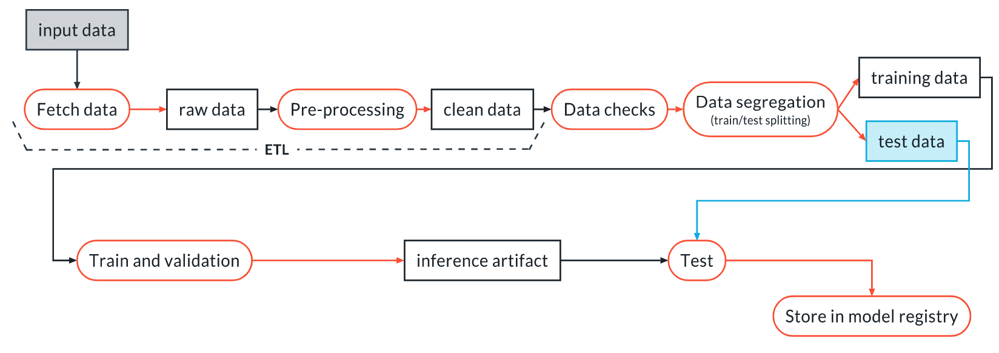

# Building Reproducible Modelling Workflow

## Machine Learning in the Wild
Research or academic ML focussed on some data exploration, improving architecture, tuning hyperparameters, and strategizing to optimize metric of interest. For example, mAP for vision models, accuracy for regression models or decision trees etc.
Following figure shows the typical workflow (source Udacity course cd0581):

## MLOps
A set of best practices and methods for an **efficient** end-to-end development and operation of **performant, scalable, reliable, automated, and reproducible** ML solutions in a **production setting** delivering **solutions to real world applications**. For example, using vision models for defect detection in manufacturing of mobile phones, voice assistants such as Mycroft, Alexa for enhanced user experience.

| Production ML Ops |
|-------------------|
|Check if ML is needed and then define ML Objective| 
|Best performance within constraints of production system, allocated time and budget.|
| Monitoring after deployment and retrain to address drifts.|
| Features during development must be usable in production with speed/cost tradeoff.|

| Model Development for Academic/Competition |
|--------------------------------------------|
| Dataset is fixed and does not change with time.|
| Development time is spend in improving model with architecture.|
| One or a few metrics are the target without any other constraints.|

## Example ML Pipeline

## ETL Pipeline

## MLOps Levels based on Use-Case

